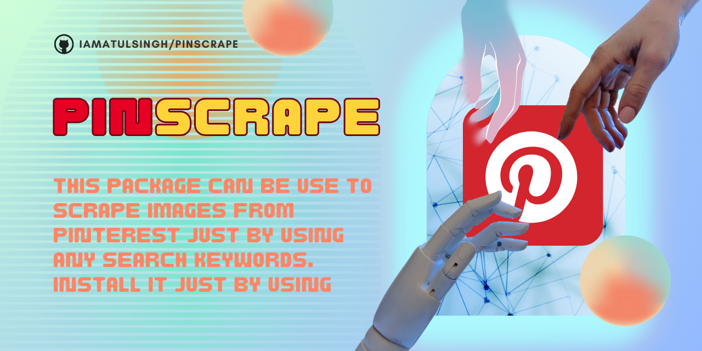

# pinscrape

<p align="center">
    
</p>

[](https://www.python.org/)

### This package can be use to scrape images from pinterest just by using any search keywords. Install it just by using <br><br>
`pip install pinscrape`
### How to use?
```python
from pinscrape import pinscrape
details = pinscrape.scraper.scrape("messi", "output", {}, 10, 15)

if details["isDownloaded"]:
    print("\nDownloading completed !!")
    print(f"\nTotal urls found: {len(details['extracted_urls'])}")
    print(f"\nTotal images downloaded (including duplicate images): {len(details['urls_list'])}")
    print(details)
else:
    print("\nNothing to download !!", details)
```

`scrape("messi", "output", {}, 10, 15)` <br/>
- `"messi"` is keyword
- `"output"` is path to a folder where you want to save images
- `{}` is proxy list if you want to add one (optional)
- `10` is a number of threads you want to use for downloading those images (optional)
- `15` is the maximum number of images you want to download (optional)
